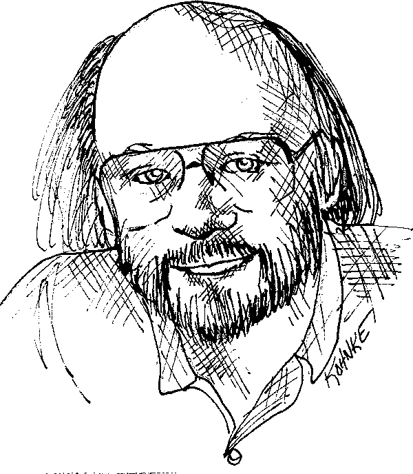

#Clean Code

##1. Mã sạch

Bạn chọn đọc cuốn sách này vì hai lẽ. Đầu tiên, bạn là một lập trình viên. Thứ hai, bạn muốn trở nên giỏi hơn. Tốt quá, chúng tai cần những lập trình viên giỏi hơn.

Cuốn sách này viết về lập trình tốt - và đầy những mã lệnh. Chúng ta sẽ xem xét
mã lệnh theo nhiều hướng khác nhau. Đọc mã từ đầu dòng xuống, từ dưới lên trên
và lần theo các khối lệnh từ trong ra ngoài. Để lúc xong rồi thì ta đã hiểu rất
nhiều về những mã đó. Không những thế còn có thể kể ra sự khác biệt giữa những 
đoạn mã tốt và những đoạn nào không hay. Chúng ta sẽ biết cách viết mã tốt. Và
biết cáchlàm cho mã lệnh xấu trở nên tốt hơn.

###Còn phải viết mã dài dài

Một vài người cho rằng sách toàn nói về mã đã là thứ gì đó lỗi thời, thay vì đó
ta nên quan tâm tới mô hình và những yêu cầu. Thực tế thì một số người cho rằng
thời đại chúng ta bây giờ đang tiến gần tới sự kết thúc của việc viết mã. Sẽ 
sớm tới ngày tất cả các mã lệnh sẽ được tự động tạo ra thay vì phải viết. Rồi 
thì đơn giản là sẽ không còn cần tới lập trình viên nữa - bởi vì những người 
kinh doanh sẽ tạo ra chương trình từ những chi tiết kỹ thuật dễ như sử dụng máy
pha cà phê. 

Hề, vô lý. Còn lâu hoặc là không bao giờ chúng ta mới có thể  thoát khỏi mã 
lệnh. Bởi vì mã lệnh đại diện cho các chi tiết của yêu cầu. Có những chi tiết 
mà ở một vài mức độ thậm chí không thể lờ đi hay trừu tượng hóa mà phải đặc tả 
rõ ràng. Mà quá trình đặc tả những chi tiết của yêu cầu này thành những chi 
tiết mà máy tính có thể hiểu được thì chính là sự lập trình. Nói trắng ra, thì 
quá trình đặc tả cũng chính là viết mã.

Tôi trông chờ mức độ trừu tượng của các ngôn ngữ lập trình sẽ tiếp tục tăng. 
Tôi cũng hi vọng rằng các DSL(1) sẽ tiếp tục phát triển. Đó là một điều tốt. 
Nhưng chúng sẽ không loại bỏ việc viết mã. Thực tế là tất cả những đặc tả được 
viết bằng những ngôn ngữ DSL cấp cao hiện nay đều "trông giống như mã" (hay 
ngược lại, mã của những ngôn ngữ đó trông giống đặc tả - ND). 

Những người tin vào tương lai tuyệt chủng của mã lệnh thật sự giống như là 
những nhà toán học hi vọng có một ngày có thể giải toán mà không cần dùng tới 
các công thức. Họ cũng có một ước mơ, rằng một ngày sẽ tìm ra cách để tạo ra 
các máy tính có thể làm những gì chúng ta muốn thay vì những gì chúng ta chỉ cho
chúng. Những máy tính này sẽ phải hiểu chúng ta tốt tới nỗi chúng có thể dịch 
những yêu cầu mơ hồ thành một chương trình đáp ứng những yêu cầu đó một cách 
tuyệt vời.

Điều đó sẽ không xảy ra. Không chỉ với con người với tất cả trực giác và khả 
năng sáng tạo của mình đã tạo ra những hệ thống thành công từ những cảm giác 
mơ hồ của khách hàng. Trên thực tế, nếu việc đặc tả các yêu cầu có thể dạy 
chúng ta điều gì, thì đó là việc một đặc tả tốt bao giờ trông cũng giống như mã
và gần như là có thể hoạt động như một kiểm thử của mã đó.

Nhớ rằng mã lệnh suy cho cùng  thật ra là ngôn ngữ để chúng ta diễn đạt các yêu
cầu. Chúng ta có thể tạo ra những ngôn ngữ lập trình gần với yêu cầu hơn. Ta 
cũng có thể tạo ra các công cụ giúp ta phân tích và ráp những yêu cầu vào cấu 
trúc chính thức. Nhưng ta sẽ không bao giờ loại bỏ sự chính xác tối thiểu - và 
thế là - còn phải viết mã dài dài nữa.

###Mã xấu

Gần đây tôi được đọc lời dẫn trong một cuốn sách của Kent Beck - cuốn 
*Triển khai mẫu hình (Implementation Patterns)*. Trong đó có câu "cuốn sách này
được dựa trên một giả thuyết khá mong manh: mã tốt là một vấn đề quan trọng". 
Một *giả thuyết mong manh*? Tôi không đồng ý. Tôi nghĩ rằng tiền đề đó là một 
trong những cơ sở mạnh mẽ nhất, được khuyến khích nhất, và nan giải nhất trong 
nghề của chúng ta (sự quan trọng đó - tôi nghĩ là Kent biết, còn chúng tôi thì 
hiểu rõ, vì đã phải đương đầu với sự hiếm hoi của mã nguồn tốt quá lâu rồi).

Tôi biết một công ty, trong những năm 80. Đã viết một ứng dụng *sát thủ*(2). 
Nó đã rất phổ biến, và rất nhiều chuyên gia đã mua và sử dụng nó. Nhưng rồi các
chu kỳ phát hành phiên bản mới ngày càng duỗi ra. Các lỗi không được sửa ở 
phiên bản trước thì vẫn tồi tại ở phiên bản hiện tại. Ứng dụng càng lúc càng 
"nặng" và hay bị lỗi tắt bất ngờ. Tôi nhớlà, đến một ngày, tôi đã tắt chương 
trình đó đi trong sự thất vọng và không bao giờ mở lại nữa. Còn công ty kia thì
đã chấm dứt kinh doanh một thời gian ngắn sau.

Hai thập kỷ sau, tôi gặp một trong những nhân viên đầu tiên của công ty đó, và 
đã hỏi anh ta những gì xảy ra. Câu trả lời đã xác nhận những e ngại của tôi. 
Họ đã vội vã tung sản phẩm ra thị trường và tạo ra một mớ mã lộn xộn. Rồi khi 
họ thêm các tính năng vào ngày càng nhiều hơn làm cho mã nguồn vốn đã tệ cũng 
trở nên ngày càng tệ hại hơn nữa. Cho đến khi họ đơn giản là không thể quản lý 
nổi mã nguồn nữa.

Vậy là, mã nguồn xấu là nguyên nhân chính đã làm công ty phải đóng cửa.

Đã bao giờ bạn gặp trở ngại to lớn do mã nguồn xấu? Nếu bạn là một lập trình 
viên từng trải, bạn hẳn đã nhận ra sự trở ngại này nhiều lần. Trên thực tế, 
chúng tôi đã đặt hẳn cho nó một cái tên. Chúng tôi gọi quá trình đó là "lội". 
Chúng tôi lội qua mã xấu, một cách vất vả qua những bãi lầy đầy gai rối và cạm
bẫy. Chúng tôi nỗ lực tìm ra con đường của mình, loay hoay để tìm ra một vài 
gợi ý, một ít đầu mối, về những gì đang xảy ra; nhưng tất cả những gì chúng tôi
thấy là nhiều và nhiều hơn nữa những dòng mã vô nghĩa.

Tất nhiên bạn đã gặp trở ngại với mã xấu. Vậy thì - tại sao bạn lại viết ra 
chúng?

Có phải bạn đã cố đi nhanh? Bạn đã vội vàng? Cứ cho là như vậy. Có lẽ bạn cảm 
thấy không đủ thời gian để nhìn đi nhìn lại; rằng sếp có thể sẽ bực mình nếu 
bạn mất thời gian vô bổ cho việc làm sạch mã. Có lẽ bạn thật ra rất mệt mỏi với
dự án này và chỉ mong cho nó xong sớm. Hoặc cũng có thể bạn nhìn vào backlog và
thấy còn rất nhiều hạng mục khác mà bạn đã hứa sẽ hoàn thành, và bạn nhận ra 
rằng phải nhanh chóng "xong" mô-đun này để có thể chuyển sang phần tiếp theo.

Chúng tôi đã cũng từng như thế. Chúng tôi đã từng nhìn vào mớ bừa bộn mình vừa
tạo ra và ngao ngán chọn để nó cho một ngày khác. Chúng tôi cảm thấy nhẹ nhõm 
khi chương trình lộn xộn của chúng tôi hoạt động được và quyết định rằng "lộn 
xộn còn hơn là không có gì". Chúng tôi  thống nhất rằng sẽ quay lại làm sạch mã
sau. Dĩ nhiên là trong những ngày đó chúng tôi đã chưa được học "luật LeBlanc":
*Để sau nghĩa là không bao giờ*.

###Tiền mất tật mang

Nếu bạn làm là người viết mã cho dự án mới hơn hai hay ba năm, bạn có thể phát 
hiện ra một chút khúc mắc bởi mã nguồn rối của một ai đó. Nếu bạn gắn bó với
dự án lâu hơn chừng đó, bạn sẽ cảm thấy ngột ngạt thực sự với mã nguồn rối. Sự 
khác biệt là khá đáng kể. Sau một hay hai năm, một đội ngũ mà đã triển khai dự 
án rất nhanh chóng ở thời điểm ban đầu có thể sẽ nhận thấy họ giờ đang đi với 
tốc độ của một con sên. Mỗi một thay đổi họ thực hiện lên mã nguồn đã làm hỏng 
vài phần mã khác. Mà nhất là chẳng có thay đổi nào là nhỏ bé. Thành ra bao 
nhiêu bổ sung chỉnh sửa lên một hệ thống vốn đã xương xẩu là bấy nhiêu xương 
xẩu được thêm vào. 

Cấu trúc lộn xộn của mã nguồn làm năng suất làm việc của nhóm liên tục giảm 
đi, gần như chạm sàn. Và vì năng suất giảm, quản lý làm việc duy nhất họ có thể
làm: bổ sung nhân lực cho dự án hòng cải thiện năng suất. Nhưng nhân viên mới 
lại không thông thạo về thiết kế hệ thống. Họ không hiểu rằng có những thay đổi
phù hợp với định hướng thiết kế trong khi một số khác thì không. Hơn nữa, họ 
cùng những người khác trong nhóm đều phải chịu áp lực khủng khiếp để tăng năng 
suất. Và tất cả họ làm ra càng ngày càng nhiều thứ rối rắm hơn, lái bánh xe 
năng suất lăn nhanh tới con số không.

####Cuộc tái cấu trúc vĩ đại trong mơ (3)

Cuối cùng thì nhóm quyết định làm điều gì đó. Họ thông báo cho quản lý rằng họ 
không thể tiếp tục với mớ mã nguồn đáng ghét này. Họ yêu cầu được thiết kế lại.
Quản lý không muốn phải dùng cạn kinh phí của dự án cho việc tái thiết. Nhưng 
họ không thể phủ nhận rằng năng suất đang thấp khủng khiếp. Cuối cùng họ nhượng
bộ yêu cầu của đội ngũ phát triển và cho phép tái thiết kế. 

Một nhóm của những tay cứng cựa được chọn ra. Ai cũng biết là dự án mới sẽ rất 
"tươi"(4), và ai cũng muốn được vào nhóm này. Họ sẽ được làm lại từ đầu (ai 
cũng thích có cơ hội làm lại từ đầu) và sẽ tạo ra một cái gì đó thật sự đẹp đẽ.
Nhưng chỉ những cá nhân xuất sắc và triển vọng nhất được lựa chọn để gia nhập 
"đội hổ". "Cũng phải có những người khác để duy trì hệ thống hiện tại chứ".

Bây giờ thì hai đội đang ở trong một cuộc đua. Đội hổ cần phải xây dựng một hệ 
thống mới có thể làm mọi thứ thay cho hệ thống cũ. Không những thế, họ còn phải
theo kịp với những thay đổi liên tục được thực hiện trên hệ thống cũ. Quản lý 
sẽ không thay thế hệ thống cũ cho tới khi hệ thống mới đã hoàn toàn đáp ứng 
được công việc của dự án.

Cuộc đua này có thể tiếp diễn qua một thời gian rất dài. Tôi đã thấy nó mất tới
mười năm. Qua thời gian, những thành viên cũ của đội hổ đã rời đi, và những 
thành viên hiện tại thì đang yêu cầu được tái thiết kế hệ thống mới bởi vì dự 
án mới đã lại là một mớ mã nguồn lộn xộn. 

####Về mặt quan điểm

Bạn đã bao giờ lội qua những vũng bùn của mã nguồn khó khăn đến nỗi phải mất 
một tuần để làm những thứ lẽ ra nên xong trong một giờ? Đã bao giờ nhận thấy lẽ
ra chỉ cần thay đổi một dòng mã thay vì phải sửa trong hàng trăm mô-đun khác 
nhau? Những chuyện như thế quá phổ biến rồi.

Tại sao những chuyện đó xảy ra với mã? Tại sao mã tốt nhanh chóng biến thành 
mã xấu. Chúng tôi đưa ra rất nhiều lời giải thích. Chúng tôi phàn nàn rằng 
những yêu cầu ban đầu liên tục bị thay đổi và bằng cách đó đã phá ngang thiết 
kế cơ sở. Chúng tôi than vãn rằng quỹ thời gian trong kế hoạch quá chặt chẽ để 
làm những thứ nên làm.

Chúng tôi huênh hoang về quản lý ngu ngốc, những khách hàng cứng cổ, các thể 
loại tiếp thị vô dụng và cả việc điện thoại bàn dơ. Nhưng lỗi, Dilbert(5) thân 
mến, không phải của những ngôi sao của chúng tôi, mà thuộc về bản thân chúng 
tôi. Chúng tôi đã không chuyên nghiệp.

Sự thật đó như một viên thuốc đắng khó nuốt trôi. Làm thế nào mà chỗ rối rắm 
này lại là lỗi của chúng tôi? Còn lịch trình thì sao? Quản lý đần độn và tiếp 
thị vớ vẩn thì sao? Chẳng lẽ họ không lãnh phần trách nhiệm nào? 

Không hề! Các quản lý và bộ phận tiếp thị tìm tới chúng tôi cho thông tin họ cần
để soạn ra những hợp đồng và cam kết; và ngay cả khi họ không tới tìm, chúng 
tôi vẫn không nên ngần ngại nói chọ họ quan điểm của mình. Người dùng thì tìm 
tới chúng tôi để xác nhận cách mà những yêu cầu được tích hợp vào hệ thống. 
Quản lý dự án thì hỏi han chúng tôi để hỗ trợ việc ra lịch trình. Chúng tôi can 
dự sâu sắc vào kế hoạch của dự án và chia sẻ rất nhiều trách nhiệm với bất kỳ 
một sự thất bại nào; đặc biệt là những thất bại bắt nguồn từ mã xấu.

Bạn có thể nói "Từ từ đã! Nếu tôi không làm những gì quản lý yêu cầu, dễ mà tôi
bị cho đi luôn."  Có lẽ là không. Thực tế là hầu hết quản lý muốn được biết 
chuyện thật sự đang diễn ra, ngay ngả khi họ hành động trông có vẻ không giống 
như thế. Hầu hết các quản lý muốn có mã tốt, ngay cả khi họ bị ám ảnh về lịch 
trình. Bạn thấy họ luôn bảo vệ sát sao tiến độ công việc và những yêu cầu, có 
gì lạ đâu? Đó là đam mê của mọi quản lý, vậy bạn cũng hãy bảo vệ sự đẹp đẽ cho 
những dòng mã của bạn giống như họ bảo vệ tiến độ của họ.

Để làm rõ chuyện này, hãy giả sử bạn là một bác sỹ và bệnh nhân yêu cầu bạn bỏ 
qua mấy công đoạn chuẩn bị rửa tay lau kéo vớ vẩn cho ca phẫu thuật, "vì chúng 
mất thời gian quá"(*). Rõ ràng bệnh nhân là ông chủ, nhưng bác sỹ hoàn toàn nên
từ chối thực hiện. Tại sao? Bởi vì chắc chắn là bác sỹ rõ ràng hơn bệnh nhân 
về nguy cơ bệnh tật và nhiễm trùng. Sẽ là không chuyên nghiệp nếu bác sĩ làm 
theo yêu cầu của bệnh nhân. 

Vì vậy cũng sẽ là không chuyên nghiệp nếu như lập trình viên nhất nhất tuân 
theo ý muốn của nhà quản lý - những người không hề am hiểu về rủi ro tới từ mã 
nguồn xấu.

####Bài toán khởi điểm

Nhà lập trình viên phải đối mặt với một bài toán hóc búa của các giá trị cơ bản.
Tất cả các nhà phát triển có kinh nghiệm một chút cũng đều hiểu rằng những đoạn
mã rắc rối rồi sẽ làm họ bị chậm lại. Và những người đó luôn cảm thấy áp lực 
buộc phải bỏ lại những mã nguồn còn rối lại, để đáp ứng thời hạn. Tóm lại, để 
đáp ứng tiến độ, họ bỏ đi phần thời gian dành cho việc gỡ rối mã nguồn.

Với chuyên gia thực thụ, họ biết rằng phần thứ hai của bài toán là không đúng.
Bạn sẽ không đáp ứng được tiến độ bằng cách tạo ra những đoạn mã lộn xộn. Thật
vậy, mã rối sẽ làm bạn chậm lại ngay lập tức, và sẽ buộc bạn phải trễ thời hạn.
Cách duy nhất để đáp ứng tiến độ - cách duy nhất để đi nhanh - đó là giữ cho mã
nguồn của bạn luôn sạch nhất mức có thể, trong bất cứ lúc nào.

####Làm sạch mã là một nghệ thuật

Giờ hãy nói với tôi rằng bạn có tin rằng mã lộn xộn là một tay ngáng đường đáng
nể. Và bạn chấp nhận rằng cách duy nhất để đi nhanh là giữ sạch sẽ mã nguồn của
bạn. Và rồi bạn tự hỏi: "làm (thế) nào để viết mã sạch?" Sẽ là không ổn chút 
nào nếu bạn cố gắng thử viết mã sạch mà không biết được "thế nào là sạch?".

Tin xấu là viết mã sạch có rất nhiều điểm giống như vẽ một bức tranh. Phần lớn
chúng ta biết như thế nào và tranh đẹp hay xấu. Nhưng có thể nhận thức được cái
đẹp trong bức xấu không có nghĩa là chúng ta biết làm thế nào để vẽ. Thế nên 
việc nhìn ra mã sạch từ mã xấu không có nghĩa là ta biết làm thế nào để viết ra
mã sạch.

Việc viết mã nguồn sạch yêu cầu sử dụng một cách kỷ luật vô số kỹ thuật nhỏ 
được ứng dụng thông qua việc liên tục luyện tập cảm giác về sự "sạch". Một vài
trong chúng ta đã có thiên bẩm với cảm giác này. Một số thì phải luyện tập để 
được trang bị nó. Nó không chỉ quan trọng trong việc làm cho chúng ta nhận thấy 
được mã tốt hay mã xấu, mà còn giúp ta nhìn ra chiến lược để áp dụng kỷ luật 
mà chúng tôi đề ra cho việc chuyển đổi mã xấu thành mã sạch.

Một lập trình viên thiếu cảm giác về mã có thể nhìn vào một mô-đun lộn xộn và 
nhận ra sự lộn xộn trong đó nhưng sẽ không biết sẽ phải làm gì tiếp theo. Lập 
trình viên có cảm giác tốt thì khác, anh ta sẽ còn xem xét các tùy chọn và các 
biến thể. Cảm giác về mã sẽ chọn cho anh ta lựa chọn biến đổi tốt nhất, hướng 
dẫn anh (cô) ta vẽ ra chuỗi hành vi để chuyển đổi mã nguồn mà vẫn bảo toàn được
ý nghĩa của mô-đun, và rồi thực hiện kịch bản đó.

Trong phạm vi nhỏ, một "lập trình viên viết mã sạch" là một nghệ sĩ người mà 
có thể sẽ xóa trắng màn hình và làm một loạt các thay đổi cho tới khi có được 
một hệ thống mã tao nhã thanh lịch theo ý muốn.

####Mã sạch là gì?

Câu hỏi này có số lượng câu trả lời cũng nhiều như số lượng lập trình viên. Vậy
nên tôi đã đi hỏi một vài người rất nổi tiếng nội công thâm hậu suy nghĩ của 
họ về vấn đề này.

#####Bjarne Stroustup, sáng lập C++ và là tác giả của Ngôn ngữ Lập trình C++

*"Tôi thích mã của tôi được tự nhiên và hiệu quả. Lô-gic nên đơn giản để làm 
cho nó khó gặp những lỗi ẩn, có tối thiểu những sự phụ thuộc để dễ dàng bảo 
trì, xử lý lỗi hoàn chỉnh theo những chiến lược khớp với nhau, và hiệu suất gần
như tối ưu để không cám dỗ người ta làm cho mã lộn xộn với sự vi phạm nguyên 
tắc tối ưu hóa. Mã sạch là một thứ tốt."*

Bjarne dùng từ "tự nhiên"(*). Đó là một từ hết xẩy. Từ điển trong MacBook® của 
tôi cung cấp các định nghĩa sau: "diện mạo tinh tế; cốt cách tao nhã; hành vi 
thoải mái, tự nhiên." Bất cứ định nghĩa nào cũng nhấn mạnh sự "dễ chịu". Rõ ràng
Bjarne cho rằng mã sạch phải là mã dễ đọc. Đọc nó sẽ làm bạn mỉm cười vui sướng
giống hệt như trải nghiệm mà một hộp nhạc thủ công từ một người thợ khéo tay 
hoặc xe hơi từ nhà thiết kế tài ba mang lại.

Bjarne cũng đề cập đến "hiệu suất" - hai lần. Có lẽ điều này không làm chúng ta
ngạc nhiên vì nó tới từ người sáng tạo ra C++ - ngôn ngữ nhanh nhất trong nhóm 
những ngôn ngữ lập trình hàng đầu; nhưng tôi nghĩ có nhiều điều để nói về hiệu 
suất chứ không chỉ mình tốc độ. Dư thừa vòng lặp là không tự nhiên, họ sẽ không 
hài lòng. Và bây giờ lưu ý từ mà Bjarne dùng để mô tả hệ quả của việc không tự 
nhiên. Ông dùng từ "cám dỗ". Có một sự thật sâu đậm ở đây. Mã xấu dùng sự lộn 
xộn để cám dỗ và phát triển. Khi những người khác thay đổi mã xấu, họ thường có
xu hướng làm cho nó tồi tệ hơn.

"Pracmatic" Dave Thomas và Andy Hunt đã nói về cùng một điều này nhưng theo một
cách khác (6). Họ sử dụng câu chuyện ẩn dụ về những cửa sổ bị hỏng. Có một tòa 
nhà với một vài cửa sổ bị hỏng và có vẻ như không mấy ai quan tâm. Kéo theo 
những người khác cũng ngừng coi sóc. Điều đó làm cho những cửa sổ khác cũng 
trở nên hỏng dần đi. Cuối cùng người ta chủ động phá vỡ chúng. Bị bỏ bê, tòa nhà
dần thành ra đầy những graphiti, và rồi thành chỗ nơi tập kết rác thải. Chỉ một 
cửa sổ bị hỏng đã bắt đầu cho cả một quá trình suy tàn.

Bjarne cũng đề cập tới việc xử lý lỗi nên tới mức hoàn chỉnh. Điều này tiến tới
kỷ luật trong việc chú ý vào chi tiết. Viết tắt các xử lý lỗi chỉ là một cách
để các lập trình viên che đậy các chi tiết. Rò rỉ bộ nhớ là một ví dụ khác, lỗi 
giành quyền điều khiển cũng thế. Đặt tên không nhất quán là một ví dụ khác nữa.
Kết quả là mã sạch gần như tự nó là bản thể hiện chi tiết.

Bjarne kết thúc với sự khẳng định rằng mã sạch là một thứ tốt. Không phải ngẫu 
nhiên mà có rất nhiều nguyên tắc thiết kế phần mềm có thể tóm lược lại thành 
lời khuyên đơn giản này. Tác giả là người đang cố gắng truyền đạt tư tưởng này.
Mã xấu đã chạm vào quá nhiều thứ, nó làm rối loạn các dự định và mục đích. Mã 
sạch thì ngược lại. Mỗi chức năng, mỗi lớp, mỗi mô-đun cho thấy sự tập trung 
vào một mục đích, một ý đồ duy nhất mà không bị sao nhãng bởi những chi tiết 
không liên quan.

#####Grady Booch, tác giả *Object Oriented Analysis and Design with Applications*

*"Mã sạch là mã đơn giản và trực tiếp. Mã sạch được đọc như đọc văn xuôi được 
viết trôi chảy. Mã sạch không bao giờ làm lu mờ ý định của người thiết kế mà nó
luôn đầy đủ cả mô hình trừu trượng mạnh mẽ dứt khoát lẫn luồng điều khiển giản
đơn."*

Grady đưa ra một vài luận điểm tương tự như Bjarne, nhưng ông ấy nhắc tới quan 
điểm "dễ đọc". Tôi đặc biệt thích quan điểm của ông về "đọc mã sạch như đọc văn
xuôi được viết trôi chảy." Hãy nhớ lại một cuốn sách được viết tốt mà bạn đã 
đọc. Nhớ lại cách mà từ ngữ đã biến mất và để lại hình ảnh trong tưởng tượng 
của bạn. Giống như xem một bộ phim! Phải không nào?  Tốt hơn rồi. Bạn thấy 
những con chữ, bạn nghe được âm thanh, được trải nghiệm sự xuất hiện của cảm 
hứng và óc khôi hài.

Đương nhiên đọc mã sạch không thể giống hoàn toàn như đọc *Chúa Nhẫn*. Nhưng ẩn
dụ đó cũng không phải là quá tệ. Bởi cũng giống như một cuốn tiểu thuyết hay, 
mã sạch phơi bày rõ ràng những căng thẳng trong vấn đề cần giải quyết. Cần đưa 
những căng thẳng lên tới đỉnh điểm và rồi làm cho người đọc "Ah, đúng rồi!" vì 
đã tiên đoán ra cách mà các vấn đề và sự căng thẳng đó được giải quyết. Chỉ có 
sách hay mới có thể trao cho người đọc cơ hội đó. Cũng như chỉ có mã sạch mới 
cho lập trình viên cơ hội "hiểu trước" cách giải quyết.

Tôi thấy việc khái niệm *"mô hình trừu tượng mạnh mẽ dứt khoát"* của Grady là 
một khái niệm thú vị (7). Mã của chúng ta tốt nhất nên đi thằng vào vấn đề. Nó 
chỉ cần làm những gì cần thiết. Và độc giả của chúng ta chỉ đọc được những gì 
cần chúng ta muốn.

#####"Big" Dave Thomas, sáng lập OTI, cha đẻ của dự án Eclipse

*"Mã sạch có thể được một nhà phát triển khác đọc và nâng cấp thêm so với bản 
gốc. Nó phải có cả kiểm thử đơn vị ở phía lập trình viên lẫn kiểm thử chấp chận 
do khách hàng thực hiện. Mã sạch cũng có những tên có ý nghĩa. Nó cũng cấp một 
phương thức giải quyết vấn đề tốt hơn hẳn những phương thức khác. Mã sạch có 
tối thiểu sự những sự phụ thuộc, cái mà luôn được định nghĩa một cách minh bạch,
và nó cũng sử dụng một cách rõ ràng và ít nhất có thể các API cần thiết. Mã nên
trông có câu chữ một chút bởi vì tùy thuộc vào ngôn ngữ, không phải mọi thông 
tin cần thiết đều có thể được thể hiện chỉ bằng mã lệnh."*

Dave chia sẻ mong muốn của Grady về sự dễ đọc, nhưng với một sự bổ sung quan 
trọng. Ông khẳng định rằng mã sạch có thể giúp người khác dễ dàng cải tiến nó. 
Điều này có vẻ hiển nhiên, nhưng không thể quá nhấn mạnh. Sau tất cả, ta thu 
được, chính là nhận thức về sự khác biệt giữa các mã theo khía cạnh mức độ dễ 
đọc và dễ dàng cải tiến.

Dave thắt chặt tính sạch sẽ với các kiểm thử. Vào thời điểm mười năm trước việc
này có thể làm nhiều người nhíu mày. Nhưng kỷ luật của phát triển hướng kiểm 
thử đã tác động sâu sắc tới toàn nghành công nghiệp phần mềm và trở thành một 
trong những nguyên tắc cơ bản nhất của chúng ta. Dave nói đúng. Mã không có 
kiểm thử thì không thể gọi là sạch. Không quan trọng nó tự nhiên trang nhã như 
thế nào, dễ dọc và dễ tiếp cận ra sao, nếu không có kiểm thử, nó đã mất tính 
sạch.

Dave đã hai lần dùng tới từ "tối thiểu". Rõ ràng ông coi trọng mã nguồn nhỏ gọn
hơn là mã nguồn dài. Thật vậy, đây là một điệp khúc phổ biến khắp "nền văn học 
phần mềm" kể từ khi nó ra đời. Càng nhỏ càng tốt.

Dave cũng nhắc tới rằng mã nên có hình thức câu chữ. Quan điểm này khá gần gũi 
với thuyết *"Lập trình với văn phạm"(8)*  của Knuth. Nghĩa là mã nên được viết
ra với một hình thức dễ hiểu cho con người.

#####Michael Feathers, tác giả *"Working Effectively with Legacy Code"*

*"Tôi có thể liệt kê tất cả những phẩm chất mà tôi nhận thấy trong mã sạch, nhưng
có một đặc trưng bao quát tất cả chúng. Mã sạch bao giờ cũng trông như được 
viết bởi những người quan tâm (tới vấn đề mã sạch). Không có manh mối nào cho 
biết bạn có thể làm gì đó để mã này tốt hơn nữa. Tất cả mọi phương án dường như
đều đã được tác giả của mã này nghĩ tới, và nếu bạn cố gắng tưởng tượng ra quá 
trình anh ta cải tiến, bạn sẽ thấy mình đang ngồi ở đây, xung quanh đầy những 
cặp mắt kỹ tính đang soi mói mã của bạn."*

Một từ thôi: "quan tâm". Hai từ đó thực sự có thể làm chủ đề cho cuốn sách này.
Còn bổ đề sẽ là "làm thế nào để chăm chút cho mã".

Michael nhấn mạnh nó đầu tiên. Mã sạch là mã mà được chăm chút cẩn thận. Một 
ai đó đã phải mất thời gian để giữ cho nó đơn giản và có trật tự. Họ đặc biệt 
tỉ mỉ. Họ để tâm.

#####Ron Jeffries, tác giả *"Extreme Programming Installed and Extreme Programming Adventures in C#*

Ron bắt đầu sự nghiệp lập trình của mình bằng ngôn ngữ Fortran tại Bộ tư lệnh 
Không quân Chiến lược và đã viết mã nguồn trong hầu hết các ngôn ngữ và trên 
gần như tất cả các loại máy tính. Kinh nghiệm đó cho anh ấy sự cẩn trong trong
dùng từ ngữ.

*"Trong những năm gần đây, tôi bắt đầu làm theo, và đã thực hiện gần hết, 
những quy tắc của Beck về mã nguồn đơn giản. Trong thứ tự ưu tiên của tôi, mã 
đơn giản là:*

+ *Chạy tất cả các kiểm thử;*
+ *Không có mã trùng lặp;*
+ *Diễn đạt tất cả các ý tưởng thiết kế có trong hệ thống;*
+ *Có tối thiểu số lượng lớp, phương thức, chức năng, và những thứ tương tự.*

*Trong số đó, tôi tập trung chủ yếu tới sự trùng lắp. Khi một điều tương tự được
thực hiện nhiều lần, đó là một dấu hiệu cho thấy có một ý tưởng trong tâm trí 
của chúng tôi đã không được triển khai hoàn hảo trong mã nguồn. Tôi cố gắng tìm
ra nó là gì. Sau đó tôi cố gắng thể hiện ý tưởng rõ ràng hơn.*

*Khả năng diễn đạt đối với tôi bao gồm việc đặt tên có ý nghĩa, và tôi thường 
phải đổi tên của một thứ gì đó nhiều lần cho tới khi vừa  ý trước khi bắt đầu 
cân nhắc bên trong. Với các công cụ viết mã hiện đại như là Eclipse, đổi tên 
không hề phức tạp, vì vậy không phải là vấn đề lớn đối với tôi trong việc đổi 
các tên. Tuy nhiên, khả năng diễn đạt cũng không chỉ nằm trong các tên. Tôi cũng
xem xét liệu có đối tượng hay phương thức nào làm nhiều hơn một việc hay không.
Nếu nó là một đối tượng, có thể sẽ cần phải chia nó thành hai hoặc nhiều đối 
tượng. Nếu nó là phương thức, tôi thường chạy chức năng tái cấu trúc "Extract 
Method" (một chức năng của Eclipse - ND) lên nó, kết quả là tôi có một phương 
thức diễn đạt trong sáng hơn về việc nó làm, và một số phương thức con diễn đạt
việc đó được làm như thế nào.*

*Sự trùng lắp và tính biểu cảm khiển tôi mất rất nhiều thời gian để làm sạch, 
đổi lại, chỉ với việc khử được hai tính chất đó thôi cũng có thể làm cho mã xấu 
trở nên trông khác đi rất nhiều. Thế thôi, tuy nhiên dù sao thì vẫn còn một điều
khác mà tôi nhận thấy (về vấn đề này), nhưng khó diễn đạt hơn một chút.*

*Sau những năm làm công việc này, tôi nhận thấy rằng có vẻ như với tôi mọi 
chương trình điều được tạo thành từ những yếu tố rất giống nhau. Ví dụ như 
"tìm thứ gì đó trong một bộ sưu tập". Cho dù cái chúng ta có là một cơ sở dữ 
liệu hồ sơ nhân viên, hay một bản đồ của khóa và giá trị, hoặc một mảng các 
phần tử loại gì đó, thì chúng ta cũng đều nảy sinh nhu cầu tìm lấy một món 
trong chỗ đó. Thế nên khi tôi muốn làm cái việc "tìm thứ gì đó" kia, tôi 
thường bao gói những phần triển khai cụ thể trong những phương thức trừu tượng
hơn. Việc này cho tôi một vài lợi ích thú vị.*

*Tôi hoàn toàn có thể triển khai chức năng ngay lúc đó một cách đơn giản, sử 
dụng một bảng băm chẳng hạn, nhưng bằng việc tham chiếu mọi chức năng tìm kiếm
tới lớp trừu tượng bé nhỏ của tôi, tôi có thể thay đổi cách thức triển khai 
việc tìm kiếm bất cứ lúc nào tôi muốn. Và tôi có thể đi làm tiếp những công 
việc khác trong khi vẫn giữ được khả năng cải tiến về sau."*

*Ngoài ra, bộ sưu tập trừu tượng thường gợi sự chú ý của tôi tới những gì đang 
thực sự được làm, và giữ cho tôi khỏi chạy xuống con đường triển khai một cách
tùy tiện những hành vi của bộ sưu tập, trong khi tất cả những gì tôi thực sự 
cần là "tìm một thứ gì đó" cơ.*

*Ít trùng lắp, mã biết nói, và sớm trừu tượng hóa những hành vi đơn giản. Những
thứ đó tạo nên nên mã sạch của tôi."*

Lần này, trong một vài đoạn ngắn, Ron đã tóm tắt nội dung của cả cuốn sách này.
Không trùng lắp, biểu cảm, trừu tượng hóa sớm những chi tiết. Cuốn sách này 
nói về tất cả những điều đó. 

#####Ward Cunningham, sáng lập Wiki, sáng lập Fit, đồng sáng lập eXtreme Programming. Động lực đằng sau cuốn Design Patterns. Lãnh đạo suy nghĩ của Smalltalk của OO. Bố Già của bất cứ ai quan tâm về mã.

*"Bạn biết mã bạn đang làm việt với là sạch khi mà mô-đun mà bạn đã xem nhiều 
lần đó giờ đã tốt hơn là bạn mong đợi. Bạn sẽ có thể gọi mã là mã đẹp khi mà 
những mã đó làm cho ngôn ngữ của nó trông cứ như là ngôn ngữ tốt nhất cho vấn 
đề mà nó đang giải quyết."*

Kiểu phát biểu này là cá tính của Ward. Bạn đọc nó, gật đầu, tưởng chừng như 
không có gì để chỉnh thêm nữa và sau đó thì chuyển sang chủ đề tiếp theo. Rõ 
ràng là phát biểu rất hợp lý còn gì, hơn nữa trông còn rất sâu sắc. Bạn có thể 
nghĩ rằng nó đã cho bạn đủ những gì mong đợi một cách tuyệt vời. Nhưng hãy dừng
lại một chút và xem xét kỹ hơn.

*"...tốt hơn những gì bạn mong đợi"*. Khi nào thì bạn có thể xem một mô-đun và 
kết luận rằng đã rất tốt? Khi mà các mô-đun không làm bạn bối rối, không phức 
tạp, không rối rắm? Không vi phạm các quy tắc và ràng buộc? Bạn có nhận ra toàn
bộ biện giải về hệ thống thông qua những mô-đun mà bạn đọc? Khi nào thì bạn có 
thể đọc qua một đoạn mã nào đó và gật đầu một cách tự nhiên như lúc bạn gật đầu
trước phát biểu của Ward?

Ward mong muốn rằng khi bạn đọc mã sạch bạn sẽ không gặp phải sự ngạc nhiên. 
Thật vậy, và thậm chí còn không phải bỏ ra nhiều nỗ lực. Bạn đọc nó, và nó thỏa
mãn được khá nhiều những gì bạn mong đợi. Nó rõ ràng, đơn giản và hấp dẫn. Mỗi
mô-đun sẽ tự nói với bạn giai đoạn gì sẽ tới hoặc cần được viết tiếp theo nó. 
Chương trình được viết sạch sẽ sẽ sâu sắc tới mức có khi bạn còn không phát 
hiện ra điều đó. Bời vì nó được thiết kế quá thật đơn giản, đơn giản tới mức 
đặc biệt.

Thế còn khái niệm của Ward về vẻ đẹp là thế nào? Tất cả chúng ta nghĩ theo lối 
mòn rằng ngôn ngữ ta dùng không được thiết kế cho vấn đề của mình. Nhưng lời 
của Ward đã đẩy trách nhiệm đó về lại cho chúng ta.

Ông nói rằng mã mang vẻ đẹp làm cho ngôn ngữ của nó trông cứ như là được sinh 
ra dành cho vấn đề mà nó đang giải quyết. Vì vậy trách nhiệm của chúng ta là 
phải làm cho nó trông thật đơn giản.  Những truyền đạt mù  quáng về ưu điểm của
ngôn ngữ nhan nhản khắp nơi, vì vậy hãy cân nhắc. Không phải là ngôn ngữ làm 
cho chương trình đơn giản đi, mà lập trình làm cho ngôn ngữ được trình diện 
một cách đơn giản.

###Võ đường của suy nghĩ

Còn tôi (Uncle Bob) thì sao? Tôi nghĩ thế nào về mã sạch? Cuốn sách này sẽ nói 
chuyện phải quấy đó, những chi tiết rất tởm, mà tôi và những bạn đồng sự nghĩ 
về mã sạch. Chúng tôi sẽ chỉ bạn biết những gì làm tạo nên một biến sạch, hàm 
sạch, lớp sạch và vân vân… Chúng tôi sẽ trình bày những ý kiến này một cách 
độc đoán, vì thế… chúng tôi sẽ không xin lỗi vì ngôn từ chối tai của mình.

Mã sạch là chiêu cuối, tư tưởng về mã sạch đang dần trở thành những bí kíp 
trong chiến trường nghành công việc của chúng ta.

Những võ sư không bao giờ hoàn toàn bằng lòng mà cho rằng một môn võ công nào 
đó đã tới mức tốt nhất, hay kỹ năng nào đó là hoàn hảo nhất trong môn phái đó. 
Bởi thế họ sáng tạo nên công phu của riêng mình, rồi tập hợp môn sinh học tập, 
và sẽ  học hỏi từ chính những môn sinh đó. Nhờ vậy mà chúng ta có Nhu-thuật 
Gracie được thành lập và giảng dạy bởi nhà Gracie ở Brazil, có Nhu-thuật 
HakkoRyu được thành lập và giảng dạy bởi Okuyama Ryuho ở Tokyo, và có 
Triệt-quyền-đạo, được Bruce Lee sáng tạo và giảng dạy ở Hoa Kỳ.

Những môn sinh của các công phu đó đắm mình trong lời dạy của những sư phụ 
mình. Họ tự trải nghiệm để tìm ra chính xác những gì người thầy muốn dạy. Và 
sau đó, khi đã lãnh ngộ, họ có thể tiếp tục học hỏi từ một bậc thầy khác để mở 
rộng kiến thức và kỹ năng của họ.

Một vài người, trở nên tinh túy trong kỹ năng đã học được, rồi từ đó nghiên cứu
và tạo nên môn công phu cùng võ đường của chính họ.

Không trường phái nào trong số đó là hoàn toàn đúng. Nhưng khi học tập tại một 
võ đường cụ thể, chúng ta sẽ mặc nhiên coi tất cả những kỹ năng được dạy trong 
đó là tuyệt đối. Chỉ sau khi ta đã học tất cả các cách khác nhau, ta mới biết 
cách tốt nhất cho ta để thực hành Hakkoryu, hay Triệt-quyền-đạo. Nhưng kết quả 
đó không ảnh hưởng tới sự đúng đắn của những kỹ năng khác.

Hãy xem cuốn sách này như một người hướng dẫn của bạn trong một võ đường về 
Mã Sạch. Những kỹ năng và bài học trong đây là con đường thực hành kỹ thuật của
chúng tôi. Chúng tôi hoàn toàn tin rằng nếu bạn làm theo những chỉ dẫn này, bạn
sẽ nhận được những lợi ích mà chúng tôi rất thích, và bạn sẽ được học viết mã 
một cách sạch sẽ và chuyên nghiệp. Nhưng đừng sai lầm khi cho rằng những gì 
được trình bày ở đây là đúng tuyệt đối và luôn phải tuân theo. Có những võ 
đường khác, và những bậc thầy khác không chỉ chúng tôi, những người có những kỹ
năng khác và những yêu cầu khác về tính chuyên nghiệp. Điều đó bắt buộc bạn 
phải tự chứng thực những gì cần học theo cho riêng mình.

Thật vậy, nhiều điều được khuyến nghị trong cuốn sách này vẫn đang gây tranh 
cãi. Bạn có thể sẽ không đồng ý với tất cả trong số chúng, và thậm chí có thể 
dữ dội bác bỏ một vài. Việc đó hoàn toàn tốt. Chúng tôi không thể yêu cầu cho 
mình quyền thắng cuối cùng. Mặt khác, những khuyến nghị trong này là những thứ 
mà chúng tôi đã phải suy nghĩ rất mông lung sau một thời gian dài mới nhận ra. 
Chúng tôi đã học được những điều đó với giá rất đắt bằng nhiều thập kỷ kinh 
nghiệm và thử nghiệm lặp đi lặp lại. Vì vậy cho dù bạn có hay không đồng ý, 
chúng tôi tin rằng sẽ là một sự xấu hổ nếu bạn thật sự không nhìn thấy được, và
tôn trọng, cách nhìn nhận của chúng tôi.

###Chúng ta là những tác giả

Javadoc dùng tên trường *"@author"* để mô tả người viết ra một đoạn mã nào đó. 
Người viết mã là một "tác giả" (author). Và một thứ mô tả về các tác giả đó là 
họ có *độc giả*. Thật vậy, những tác giả có trách nhiệm phải giao tiếp và phản 
hồi với độc giả của họ. Lần sau, khi bạn viết mã, hãy nhớ mình là tác giả, 
đang viết cho những độc giả người mà sẽ đánh giá nỗ lực của bạn.

Bạn có thể thắc mắc: "mã thật sự được đọc nhiều như thế á?". "Chẳng phải là hầu
hết các nỗ lực đều đã bỏ ra cho việc viết ra nó mất rồi sao?".

Trong những năm 80 và 90, chúng tôi chủ yếu sử dụng những editor như là Emacs, 
chúng có một tinh năng rất hay là có thể lưu giữ bản ghi của tất cả những lần 
gõ phím. Bạn có thể ghi như thế trong một giờ và sau đó phát lại toàn bộ phiên 
làm việc như đang xem một đoạn phim tua nhanh. Tôi đã từng làm như thế, và kết 
quả thực sự thú vị.	

Phần lớn các tác vụ tôi xem thấy đó là cuộn và nhảy tới các mô-đun khác.

*"Bob nhảy vào một mô-đun."*

*"Anh ta cuộn xuống chức năng cần phải sửa đổi."*

*"Anh ấy dừng lại, cân nhắc các lựa chọn."*

*"Ô, giờ thì hắn cuộn lên đầu mô-đun để kiểm tra các hàm khởi tạo."*

*"Giờ anh ấy cuộn lại chỗ cũ và bắt đầu gõ."*

*"Opp, hắn xóa những gì vừa gõ."*

*"... gõ lại."*

*"... lại xóa."*

*"... gõ vào một nửa của một cái gì đó, nhưng rồi lại xóa nó đi."*

*"Anh ta cuộn xuống một chức năng khác, chỗ mà có lời gọi tới chức năng anh ta
đang sưa đổi, để xem tên nó là gì."*

*"... cuộn lại chỗ cũ, gõ lại y hệt những gì vừa xóa."*

*"... cân nhắc cái gì đó."*

*"Giờ thì lại lại xóa!!!"*

*"Anh ta mở tạm một cửa sổ khác để xem xét một subclass trong mô-đun. Xem xem 
chức năng trong đó có xảy ra việc bị nạp chồng hay không."*

Thấy gì chứ? Bạn đã lầm. Trong thực tế, tỷ lệ giữa thời gian bạn đọc mã so với
thời gian viết nó là hơn 10 ăn 1.

Chúng tôi đã không ngừng đọc lại mã cũ như một phần trong nỗ lực viết nên mã 
mới. Và bởi vì tỷ lệ này là quá cao, chúng tôi muốn cải thiện mã để dễ đọc hơn,
ngay cả khi nó làm cho việc viết trở nên khó khăn hơn. Nhưng tất nhiên không 
thể nào ta viết mã mà không đọc nó, thế nên làm cho mã dễ đọc cũng thực sự làm 
cho mã trở nên dễ viết.

Không có cách nào để thoát khỏi lô-gic này - bạn không thể viết mã nếu bạn 
không thể đọc được mã xung quanh. Đoạn mã hôm nay sẽ khó hay dễ để viết phụ 
thuộc vào những đoạn mã liên quan đến nó là khó hay dễ để đọc. Vì vậy nếu bạn 
muốn công việc của bạn trôi chảy, muốn xong nhanh, muốn viết ra mã dễ dàng 
hơn - trước hết hãy làm cho nó dễ đọc.

###Luật hướng đạo

Chỉ viết mã tốt thôi là không đủ. Mã còn phải được giữ sạch theo thời gian. Tất
cả chúng ta đều đã chứng kiến mã xấu đi và giảm chất lượng theo thời gian. Do 
đó chúng ta cần phải giữ một vai trò tích cực trong việc ngăn ngừa sự suy thoái
này.

Liên quan đến việc này, những cậu bé hướng đạo sinh của nước Mỹ tuân theo một 
luật đơn giản mà chúng ta cũng có thể áp dụng.

*"Rời khỏi khu cắm trại sạch hơn lúc bạn tìm thấy nó."*

Nếu chúng ta kiểm tra mã của mình một chút trước khi rời đi, mã đơn giản là sẽ 
không bị thối. Việc làm sạch không phải là thứ gì đó quá phức tạp. Đơn giản có 
thể chỉ là đổi tên một biến nào đó cho tốt hơn, phân tách một vài chức năng quá 
dài, khử một vài đoạn mã lặp, làm sạch một khối lệnh `if` phức tạp v.v..

Bạn có tưởng tượng được việc làm việc trên một dự án mà mã đơn giản là cứ mỗi 
ngày một trông đẹp hơn? Bạn có tin tưởng rằng có thứ gì thể hiện sự chuyên 
nghiệp tốt hơn điều đó không? Nghĩ lại, chẳng phải *"cải tiến liên tục"* là 
một phần bản chất của tính chuyên nghiệp sao?

###Hai cuốn sách

Về nhiều mặt, cuốn sách này là một bản viết lại từ một cuốn khác mà tôi đã hoàn
thành vào năm 2002 với tựa đề  *"Agile Software Development: Principles, 
Patterns, and Practices"* (PPP).  Cuốn PPP bản thân nó liên quan tới các nguyên
tắc của thiết kế hướng đối tượng, và có rất nhiều các bài thực hành được soạn 
bởi các nhà thiết kế chuyên nghiệp. Nếu bạn chưa đọc nó, thì may mắn là nó là 
phần sau của câu chuyện được kể trong cuốn sách này. Nếu bạn đã đọc PPP, thì 
giờ đây bạn có cơ hội tìm thấy rất nhiều cảm hứng của nó được lặp lại trong 
cuốn sách này, nhưng ở cấp độ của mã.

Trong cuốn sách này bạn sẽ thường xuyên tìm thấy những tài liệu tham chiếu đến 
những nguyên tắc khác nhau của thiết kế. Trong số đó bao gồm Nguyên tắc Đơn 
trách nhiệm, Nguyên tắc Đóng - Mở, Nguyên tắc Phụ thuộc ngược, và một vài khác.
Những nguyên tắc đó được trình bày một cách có chiều sâu trong PPP.

###Lời bàn

Phải chấp nhận rằng một cuốn sách về nghệ thuật không đảm bảo rằng sẽ giúp bạn 
trở thành nghệ sĩ. Tất cả những gì nó làm đó là cung cấp cho bạn một số công 
cụ, kỹ thuật và cách suy nghĩ mà những nghệ sĩ khác đã sử dụng. Và cũng tương 
tự như thế cuốn sách này không hứa hẹn sẽ làm bạn trở thành một lập trình viên 
tốt. nó không thể đảm bảo sẽ cho bạn những đoạn mã có hồn. Tất cả nó làm là cho
bạn  thấy quá trình suy nghĩ của những nhà phát triển phần mềm có kinh nghiệm 
và những thủ thuật, kỹ thuật và công cụ mà họ đã dùng.

Cũng giống như một cuốn sách về nghệ thuật, bạn sẽ thấy cuốn sách này có rất 
nhiều những miêu tả chi tiết. Bạn sẽ thấy rất nhiều mã. Có cả mã tốt và mã xấu.
Và bạn sẽ thấy quá trình chuyển mã xấu thành mã tốt. Bạn sẽ thấy cả những danh 
sách của các kỹ thuật tự động, những nguyên tắc, và những kỹ thuật. Sẽ thấy ví 
dụ này nối tiếp ví dụ kia. Và sau đó là gì sẽ phụ thuộc vào chính bản thân bạn.

Con đường để tới mức chuyên nghiệp chỉ có thể là Luyện tập và Luyện tập thôi.

###Những tham khảo

	*[Beck07]: Implementation Patterns, Kent Beck, Addison-Wesley, 2007.*

	*[Knuth92]: Literate Programming, Donald E. Knuth, Center for the Study of 
	Language and Information, Leland Stanford Junior University, 1992.*

###Chú thích

*(1) "Domain-Specific Languages": ngôn ngữ (cho) miền cụ thể - trong phát triển 
phần mềm, là một loại ngôn ngữ lập trình dành riêng cho một vấn đề / kỹ thuật 
biểu diễn / giải pháp cụ thể. HTML là một ví dụ về DSL. Trái ngược với DSL là 
General-purpose Programming Language ( những ngôn ngữ lập trình được thiết kế 
cho việc giải quyết nhiều vấn đề trên diện rộng, điển hình là C, Java, Python )
và General-purpose Modeling Language mà UML là một ví dụ.*

*(2) "Killer App" (thuật ngữ marketing): một ứng dụng mà rất cần thiết hoặc rất 
đáng sở hữu vì nó chứng tỏ được giá trị cốt lõi của một cả một nền tảng (như 
phần cứng máy tính, máy chơi game, phần mềm, ngôn ngữ lập trình, hay hệ điều 
hành). Nói cách khác, người dùng sẽ chịu mua phần cứng (thường là đắt tiền) chỉ 
vì nó chạy được ứng dụng đó. Một ứng dụng sát thủ có thể làm tăng đáng kể doanh
số bán hàng của nền tảng mà trên đó nó chạy - theo wiki (ND).*

*(3) "The Grand Redesign in the Sky": Tác giả chơi chữ khi nhại lại
tựa ca khúc "Lucy in the Sky with Diamonds" - từng bị cho là The Beatles viết 
ca khúc này trong cơn ảo giác của thuốc LSD*

*(4) "Greenfield Project": một dự án làm mới từ đầu mà không hề có sự áp đặt, 
không hiện diện sự tái sử dụng những dự án trước đó, tương tự như xây dựng trên
một đồng cỏ trống, không cần phải dựa trên việc sửa sang hay phá hủy những thứ
đã có sẵn (theo wiki - ND ).*

*(5) "Dilbert": một nhân vật trong một bộ phim hoạt hình của Mỹ. Nhân vật này 
là một kỹ sư IT, bằng cấp cao, yêu công việc, nhưng nghèo, có cuộc sống tình 
cảm thảm họa, luôn đứng trước ngưỡng bị sa thải.*

*(6) [Pracmatic Bookshelfs][http://www.pragmaticprogrammer.com/booksellers/2004-12.html]*

*(7) Nguyên bản là "scrip" - đồng nghĩa với "giòn".*

*(8) "Literate Programing": cách tiếp cận với lập trình mà chương trình được 
viết như một lời giải thích cho tính logic của chương trình bằng ngôn ngữ tự 
nhiên, xen kẽ với mã lệnh truyền thống, được khởi xướng bởi Donald Knuth - nhà 
khoa học máy tính nổi tiếng, tác giả bộ sách "Nghệ thuật lập trình máy tính", 
tác giả hệ thống sắp chữ TeX và hệ thống phác họa phông chữ Metafont, và là cha 
đẻ của nghành phân tích thuật toán.*

